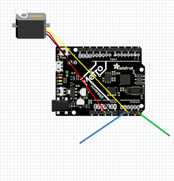
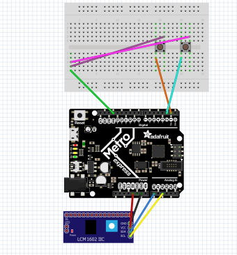
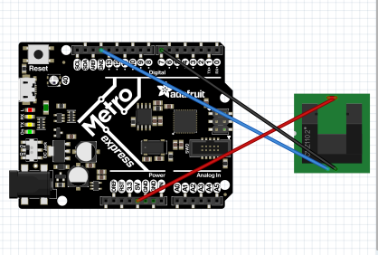
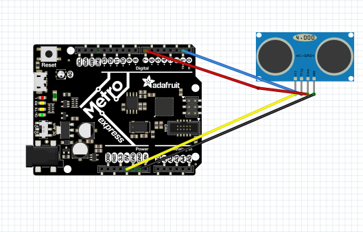
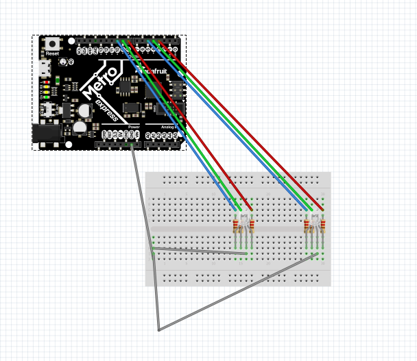
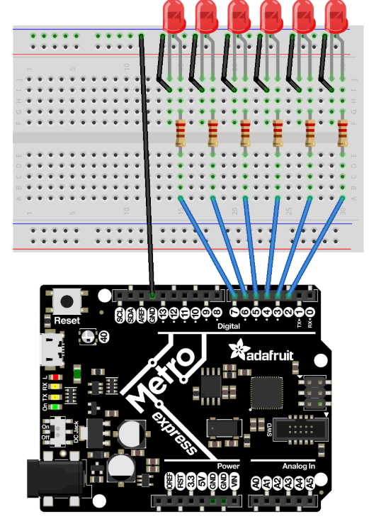

# CircuitPython 

	
# Hello CircuitPython 

This was my first circuitpython assignment, It was pretty simple, all I had to do was copy some code given to me from canvas.
In this assignment I learned some of the very basics of CircuitPython. 
In this assignent there weren't any tricky or hard parts because it was pretty much copy and pasting code from Canvas.  

# CircuitPython Servo 

In this assignemnt I had to make a servo move in either direction when a wire was touched. This was something that I had not done before so I had to use google to try and help me, but with some time I figured out how to complete it.
In this assignment I learned how to use the "Capacitive Touch"
During this assignment a tricky part that I had to solve was learning how to use captive touch, but with some help of google I figured it out fairley quickly. 

# CircuitPython LCD 

During this assignment I had to wire up an lcd screen and make it have a counter that told you how many times you pressed it in the up direction, also it had another button that switched it so that when you clicked the other button it made the number go down instead of up. 
This assignment gave me some trouble for multiple reasons, one my buttons were very inconsistent in the fact that it only recognized that I was clicking the button about 50% of the time. Also I didn't know what strings were and I learned how to use them to make this assignment work. 
For the next time I do something similar to this I would like to avoid using the same type of buttons that I used because they were very very inconsitent and made the process of completing this assignment very hard. 

 

# CircuitPython Photointerrupters 

For this assignment I had to use a photointerrupter to detect how many times something interrupted it every 4 seconds. This was not all that difficult of an assignment to do, I just had to use some google to help me. 
I learned how to wire up and use a photointerrupter with CircuitPython in this assignment. 
An obstacle that I had during this assignment was getting the photointerrupter wired up correctly, I had a problem with getting the wires wrapped around the metal prongs on the photointerrupter without having them touching eachother. The way that I could avoid this next time is by taking more time and being more careful while wiring it. 

	  

# CircuitPython Distance Censor 

For this assignment I had to make the distance censor measure how far something was away from it, this was easy because we pretty much did this same thing last year. The only thing that was diffrent was that the neopixel light on the board would fade between diffrent colors depending on how far away whatever was in the way of the censor. 
So I learned how to make the neopixel and the distance censor talk to eachother so it knew what color to fade to and at what distance. 
Something that I would like to avoid is going so fast when I put files into my "lib" folder because I ended up putting the wrong file into it and I hadn't realized and it made my code not work so it slowed me down in completing this assignment. 
 
 

# CircuitPython Classes, Objects, and Modules 

For this assignment I had to make a class that allowed 2 RGB Leds to go through a couple of colors. It wasn't all that challenging for me, the most challenging part was for getting the classes to link up with eachother so it worked, but after some time I figured it out. In this assignment I learned how to make a class.

# CircuitPython Hello VS Code 

This assignment was fairley simple, all I had to do was follow the directions on canvas. I learned how to use VS, the most challenging part of it was finding all the things that I had to find in order to set it up. 

# CricuitPython Fancy LED 

This assignment was very easy for me, there was a diagram for the wiring on canvas and the rest was fairley simple having done the Classes assignment already. I continued to learn how to use the VS code software and just continued to get more comftorable. I only had one problem and that was one that I could not fix, whenever I tried to save my code it said it did not recognize "Import Board" so I got Dr.Shields do so some fancy magic and he fixed it eventually. 

